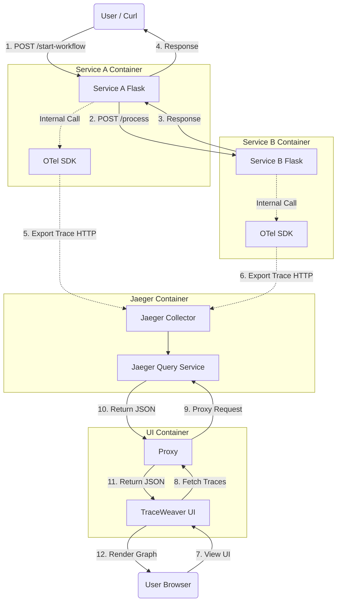

# TraceWeaver Architecture Diagram

This diagram illustrates the flow of requests (solid lines) and the flow of trace data (dotted lines) in the TraceWeaver system.

### Key Components

1.  **User / Curl**: Initiates the workflow.
2.  **Service A & B**: The microservices doing the work. They contain the **OTel SDK** (library) which automatically captures timing and metadata.
3.  **OTel SDK**: The "agent" inside the code. It buffers spans and sends them to Jaeger asynchronously.
4.  **Jaeger**: The backend that receives, stores, and serves trace data.
5.  **TraceWeaver UI**: The frontend that visualizes the data. It uses a **Proxy** to talk to Jaeger to avoid browser security restrictions (CORS).
